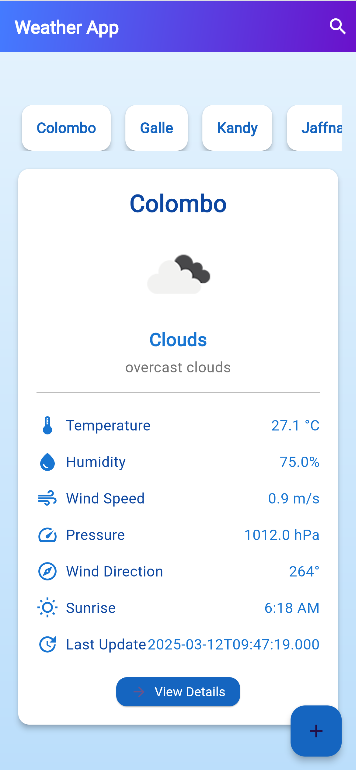
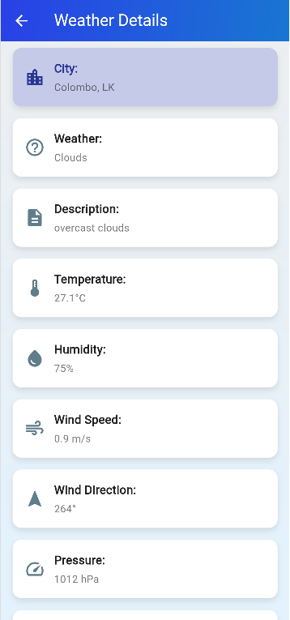
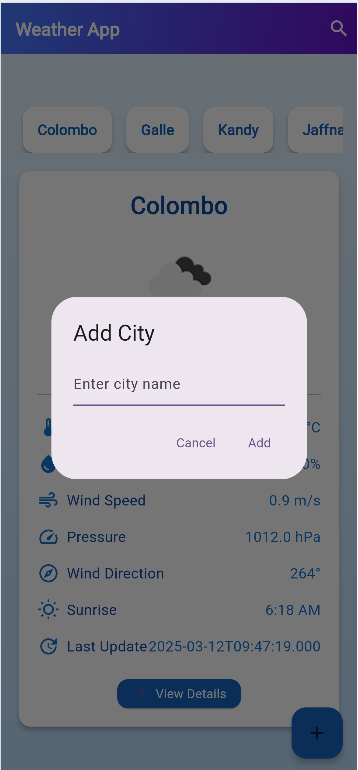

# Flutter Weather App 🌦️

A simple and elegant Weather App built using Flutter that allows users to search for locations, add favorite cities, and fetch real-time weather data using a Weather API. The app features a clean and responsive UI with a Home page and a Details page.

## Features ✨

- **🏠 Home Page**: Displays current weather information for the selected location.
- **📄 Details Page**: Provides extended weather details, including temperature, humidity, wind speed, and more.
- **🔍 Search Location**: Users can search for weather information by city name.
- **➕ Add Location**: Save preferred locations for quick access.
- **🌐 Weather API Integration**: Fetches real-time weather data using a Weather API (e.g., OpenWeatherMap).
- **📱 Responsive UI**: Built with Flutter widgets to ensure a smooth experience across devices.

## Screenshots 📸

Here are some screenshots of the app in action:

| **Home Page** | **Details Page** | **Add City** |
|---------------|------------------|--------------|
|  |  |  |


### Prerequisites 📋

- **Flutter SDK**: Ensure you have Flutter installed. If not, follow the [official installation guide](https://flutter.dev/docs/get-started/install).
- **Dart**: Comes bundled with Flutter SDK.
- **IDE**: Android Studio or VS Code with the Flutter and Dart plugins installed.
- **Weather API Key**: Sign up for a free API key from [OpenWeatherMap](https://openweathermap.org/api).

### Installation ⚙️

1. **Clone the repository**:
   ```bash
   git clone https://github.com/deshanjagoda/WeatherApp.git
   cd WeatherApp
